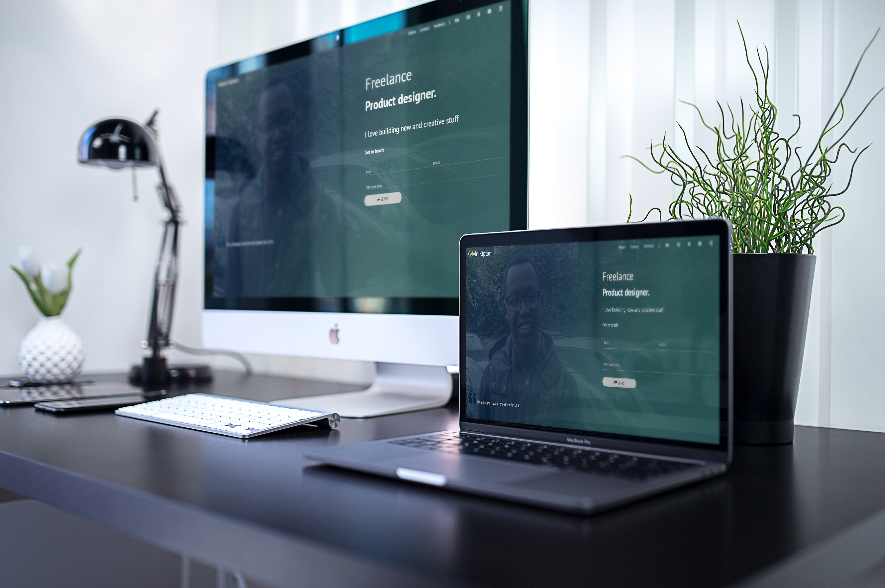

# freelance_portfolio

freelance_portfolio is a freelancer showcase and contact form page built on materialize-css.

**Css**
* materialize.min.css v1.0.0
* all.min.css (font-awesome)

**Js**
* materialize.min.js v1.0.0

**Icons**
* font-awesome v5.8.1 (all.min.css)

**Fonts**
* By Google Fonts -> PT Sans

**Stock Images**  
* Image assets have an <b>attribution</b> license, for this website I used them as placeholders for a 
better look & feel, as well as user experience.

<b>NOTE</b>  
Usage requires attribution.
